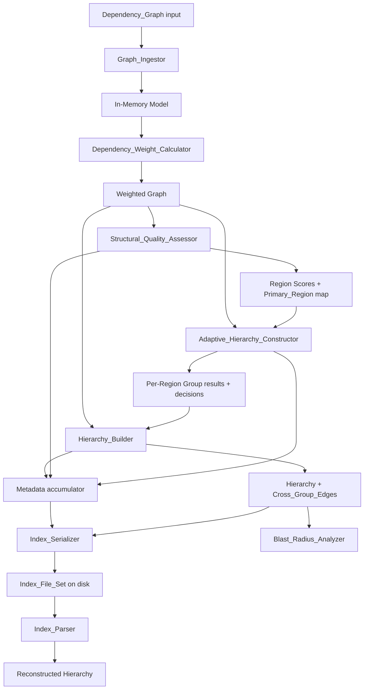

# Design Document

## Overview

The Hierarchical Repository Grouping algorithm transforms a large, flat dependency graph produced by the Tree-Sitter parsing layer into a navigable, multi-level hierarchy of the form `Repository → Level 1 Groups → Level 2 Groups → Files → Functions`, and emits it as a set of JSON index files.

The defining contribution is **adaptive hierarchy construction driven by repository structural quality**. Rather than imposing one global grouping method, the system measures the structural quality of each region (Cohesion + Coupling, with optional Newman modularity as a secondary signal), then decides per region whether to **preserve** existing package/directory boundaries (well-structured regions) or **reconstruct** boundaries via dependency-based community detection (poorly-structured regions). Every decision, score, and parameter is recorded in metadata so the preserve-versus-reconstruct boundary is auditable, reproducible, and amenable to sensitivity analysis.

This design targets **TypeScript / Node.js**, which aligns with the React + React Flow visualization consumer and gives access to a mature graph ecosystem. Key external libraries:

- [`graphology`](https://graphology.github.io/) — the in-memory directed, weighted multigraph model and traversal utilities (connected components, DAG/cycle checks, topological ordering).
- [`graphology-communities-louvain`](https://www.npmjs.com/package/graphology-communities-louvain) — the Phase 1 community-detection backend behind the `CommunityDetector` abstraction (see below). It accepts an injectable `rng` (random number generator), which we seed deterministically to satisfy the reproducibility requirements.
- [`graphology-metrics`](https://graphology.github.io/standard-library/) — modularity (`Q`) computation for the optional secondary signal.
- [`fast-check`](https://fast-check.dev/) — property-based testing (QuickCheck-style) for the universal correctness properties below.

> Research note: The research contribution is **Adaptive Construction** — the per-region preserve-versus-reconstruct decision driven by structural quality — not any single community-detection algorithm. The Reconstruct_Action therefore depends on a `CommunityDetector` interface rather than on Louvain directly. Phase 1 ships a `LouvainCommunityDetector` implementation, and alternative detectors (Leiden, Infomap, label propagation, etc.) can be substituted without changing any interface or any other component. Because the default Louvain implementation is order- and seed-sensitive, the `LouvainCommunityDetector` runs with a deterministic seeded PRNG and feeds nodes/edges in a canonical (identifier-sorted) order, then re-labels resulting communities by a content-derived key, satisfying Requirements 4.7 and 7.x. Content was rephrased for compliance with licensing restrictions.

### Scope

In scope (this spec): graph ingestion, dependency-strength weighting, structural-quality assessment, adaptive preserve/reconstruct construction, metadata recording, multi-level hierarchy assembly, dependency preservation and cross-group edge aggregation, determinism, blast radius analysis, and the JSON index output format.

Out of scope: intent detection, automatic flow naming, repository semantic understanding, and LLM-generated architecture decisions.

Phase 1 implementation narrows Region identification to a single concrete strategy — **Java packages**, where each declared package is a Region — while the data model and interfaces remain general so later ecosystems (Node, Python, monorepos) and module/directory subtrees can be added without interface changes.

## Architecture

The system is a pipeline of pure, independently testable components. Each stage consumes an immutable input and produces a new immutable value; no stage mutates a shared graph in place. This separation is what makes determinism and property testing tractable.



### Data flow stages

1. **Ingest** — validate and load the input into a `graphology` directed graph; reject malformed input atomically.
2. **Weight** — assign a `Dependency_Strength` to every edge from import/call/shared-type signals.
3. **Assess** — identify Regions, assign each File node a Primary_Region, compute Cohesion/Coupling (+ optional Modularity) and a combined `Structural_Quality_Score` per Region.
4. **Construct** — compare each Primary_Region's score to the `Structural_Quality_Boundary`; apply Preserve_Action or Reconstruct_Action (or a user override); emit per-region group results plus decision metadata.
5. **Assemble** — build the multi-level hierarchy, enforce max group size via partitioning, derive stable content-based identifiers, aggregate cross-group edges.
6. **Serialize / Parse** — write and read back the five-file `Index_File_Set` with round-trip fidelity.
7. **Analyze** — answer blast-radius queries by reverse dependency traversal.

### Determinism strategy (cross-cutting)

Determinism (Requirements 2.6, 3.10, 4.7, 5.7, 7.x, 10.8) is enforced by three rules applied everywhere:

- **Canonical ordering**: any iteration over nodes or edges that can affect output is performed over a list sorted by node identifier (and, for edges, by `(source, target)`), never over insertion order.
- **No ambient nondeterminism**: identifiers are never derived from counters, timestamps, wall-clock, memory addresses, `Math.random`, or input position. Community detection uses a fixed seeded PRNG.
- **Content-addressed identifiers**: every `Group_Node` identifier is a hash of its canonicalized membership, so the same contents always yield the same identifier regardless of how they were produced.

## Components and Interfaces

All components are exposed as pure functions returning a discriminated `Result<T, GroupingError>` union (`{ ok: true, value: T } | { ok: false, error: GroupingError }`) rather than throwing, so error conditions are part of the type and testable as values.

### Graph_Ingestor

```typescript
interface GraphIngestor {
  // Req 1: validate atomically, load all nodes/edges, reject on any structural defect.
  ingest(input: RawDependencyGraph | null): Result<DependencyModel, GroupingError>;
}
```

Validation order (all-or-nothing, no partial load): null/absent input (1.6) → zero nodes (1.3) → duplicate node id (1.5) → dangling edge endpoint (1.2). On success the model contains exactly the input node and edge sets (1.1, 1.4).

### Dependency_Weight_Calculator

```typescript
interface DependencyWeightCalculator {
  // Req 2: assign exactly one finite, non-negative strength to every edge.
  computeWeights(model: DependencyModel): WeightedModel;
}

// Default weighting: w = a*importFreq + b*callFreq + c*sharedTypeCount, with non-negative coefficients.
// Monotonic-leaning but not required to be strictly monotonic (2.4); zero inputs → zero (2.5); deterministic (2.6).
```

### Structural_Quality_Assessor

```typescript
interface StructuralQualityAssessor {
  // Req 3: identify Regions, assign Primary_Region per File node, score each Region.
  assess(model: WeightedModel, config: AssessmentConfig): RegionAssessment;
}

interface AssessmentConfig {
  weights: { cohesion: number; coupling: number; modularity?: number }; // recorded in metadata (3.7); active weights renormalized to sum to 1.0
  computeModularity: boolean;                                            // optional secondary signal (3.5)
  cohesionSquashConstant: number;                                       // k_cohesion for cohesion_norm = cohesion/(cohesion+k); default 1.0; recorded in metadata
}

interface RegionAssessment {
  regions: RegionScore[];
  primaryRegionOf: Map<NodeId, RegionId>; // total + non-overlapping over File nodes (3.1, 3.2)
}
```

- **Cohesion** (3.3): sum of `Dependency_Strength` of intra-Region edges, normalized by node count. *Design note (scale-relative caveat):* this ratio is scale-relative — two Regions with the same internal-strength-per-node ratio but very different absolute size are treated as equivalent in Cohesion. This is an accepted Phase 1 simplification. A future refinement could normalize internal strength by the number of *possible* intra-Region edges (a density measure) rather than by node count, making Cohesion sensitive to how completely a Region's potential connections are realized. Not a blocker for Phase 1.
- **Coupling** (3.4): sum of `Dependency_Strength` of boundary-crossing edges, normalized by total strength incident to the Region's nodes. By construction this is already a ratio in `[0, 1]`.
- **Modularity** (3.5, optional): Newman `Q` of the Region partition via `graphology-metrics`. Its natural range is approximately `[-0.5, 1]`.
- **Normalization to a common scale** (3.6): the three raw metrics live on incompatible scales — raw Cohesion is unbounded above (it can be 20 for one Region and 0.3 for another), Coupling is already a ratio in `[0, 1]`, and Modularity is roughly `[-0.5, 1]`. Combining them directly with a weighted sum would be dominated by whichever metric happens to have the largest magnitude and would not be defensible. We therefore map each raw metric to a normalized value in `[0, 1]` **before** the weighted sum, using the following principled, deterministic functions:
  - **Cohesion → `cohesion_norm ∈ [0, 1]`** via a *bounded squashing function* `cohesion_norm = cohesion / (cohesion + k_cohesion)`, where `k_cohesion` is a documented, externally configurable constant (default `1.0`) representing the Cohesion value that maps to the neutral midpoint `0.5`. This squashing function is chosen over min-max for Cohesion because Cohesion is unbounded above and we want a single Region's score to be meaningful in isolation (not dependent on the spread of other Regions in the run); it is monotonic increasing, maps `0 → 0`, and asymptotes to `1`, so larger Cohesion always yields a larger normalized value. `k_cohesion` is recorded in metadata so its effect is auditable and tunable.
  - **Coupling → `coupling_norm ∈ [0, 1]`**: Coupling is already a ratio in `[0, 1]`, so `coupling_norm = coupling` (clamped to `[0, 1]` for numeric safety). Because lower Coupling indicates better structure, the score uses its complement `(1 − coupling_norm)`.
  - **Modularity → `modularity_norm ∈ [0, 1]`** (only when computed) via an affine map of its theoretical range onto `[0, 1]`: `modularity_norm = clamp((Q + 0.5) / 1.5, 0, 1)`. This is deterministic and independent of the other Regions in the run.
- **Score** (3.6): the normalized inputs `cohesion_norm`, `(1 − coupling_norm)`, and (optionally) `modularity_norm` are each in `[0, 1]`. The Structural_Quality_Score is their weighted sum using the externally configured per-metric weights, where the active weights are normalized to sum to `1.0` (if Modularity is not computed, its weight is dropped and the remaining weights are renormalized to sum to `1.0`). Because every normalized input lies in `[0, 1]` and the weights are non-negative and sum to `1.0`, the weighted sum is guaranteed to lie in `[0, 1]`; a final clamp to `[0.0, 1.0]` guards only against floating-point rounding. This construction makes the combination meaningful (all terms are commensurable), deterministic (the squashing and affine maps depend only on the raw metric and documented constants, not on wall-clock, ordering, or randomness), and reproducible.
  - **Determinism note:** all three normalization functions depend only on the Region's own raw metric value plus documented constants (`k_cohesion`, the Modularity range bounds), never on the spread of other Regions. This deliberately avoids min-max normalization across the run's Region set for the *primary* score, so a Region's score does not change when unrelated Regions are added or removed. Min-max normalization remains available as a metadata-only diagnostic for sensitivity analysis (see Evaluation Design), but it is not part of the score that drives the preserve-versus-reconstruct decision.
  - **Degenerate / single-Region handling:** because normalization is per-Region (not min-max across the run), the single-Region case is well-defined — there is no `min == max` ambiguity to resolve. The bounded squashing and affine maps are total functions over their domains. Regions that are degenerate under Requirement 3.9 (see below) bypass normalization entirely and receive the documented degenerate score.
- **Degenerate rule** (3.9): a Region with `< 2` nodes or `0` internal edges receives a documented neutral score (default `0.0`, i.e., treated as poorly-structured) and never an undefined/NaN value.

**Primary_Region precedence** (from glossary): most-specific declared package/module boundary containing the File node; if none, the most-specific directory subtree. Ties broken by lexicographic Region identifier for determinism.

### Adaptive_Hierarchy_Constructor

#### Community detection abstraction

The Reconstruct_Action does not depend on Louvain directly. It depends on a `CommunityDetector` interface, so the research contribution is **Adaptive Construction** rather than "Adaptive Construction using Louvain". Any detector that partitions a weighted subgraph into communities can be plugged in without changing the constructor or any other component.

```typescript
interface CommunityAssignment {
  // community label per node id, over the nodes of the supplied subgraph
  communityOf: Map<NodeId, number>;
}

interface CommunityDetector {
  // Detect communities over a Region's weighted subgraph. The seed makes the
  // result deterministic for detectors that are inherently stochastic.
  detect(subgraph: WeightedModel, seed: number): CommunityAssignment;
}
```

Phase 1 provides a single implementation:

```typescript
// Phase 1 implementation. Leiden/Infomap/label-propagation detectors can be
// substituted later without any interface change.
class LouvainCommunityDetector implements CommunityDetector {
  // Runs graphology-communities-louvain with a deterministic seeded PRNG over
  // canonically (identifier-)sorted nodes/edges, then re-labels the resulting
  // communities by a content-derived key so output is order- and run-stable.
  detect(subgraph: WeightedModel, seed: number): CommunityAssignment { /* ... */ }
}
```

```typescript
interface AdaptiveHierarchyConstructor {
  // Req 4 & 5: decide preserve vs reconstruct per Primary_Region, execute, record metadata.
  construct(
    model: WeightedModel,
    assessment: RegionAssessment,
    config: ConstructionConfig,
    detector: CommunityDetector            // injected; Phase 1 default = LouvainCommunityDetector
  ): ConstructionResult;
}

interface ConstructionConfig {
  structuralQualityBoundary: number;            // externally configurable (4.4)
  overrides?: Map<RegionId, "preserve" | "reconstruct">; // user override (4.6)
  communityDetectionSeed: number;               // passed to CommunityDetector.detect for determinism (4.7)
}

interface ConstructionResult {
  regionGroups: Map<RegionId, GroupNode[]>;     // every File node lands in exactly one (4.5)
  decisions: RegionDecision[];                  // for metadata (Req 5)
}

interface RegionDecision {
  regionId: RegionId;
  cohesion: number; coupling: number; modularity?: number;
  score: number;
  action: "preserve" | "reconstruct";
  automaticAction: "preserve" | "reconstruct";  // recorded even when overridden (5.6)
  userOverridden: boolean;
  decisionConfidence: number;                    // |score − boundary| (5.4)
}
```

- **Preserve** (4.2): score `≥` boundary → keep existing package/directory boundaries as Group_Node boundaries.
- **Reconstruct** (4.3): score `<` boundary → invoke the injected `CommunityDetector` over the Region's nodes and strength-weighted edges, seeded for determinism. Phase 1 uses `LouvainCommunityDetector`; the constructor is agnostic to which detector is supplied.
- The boundary, per-metric weights, per-region scores/decisions/confidence, and override provenance are all written to metadata (5.1–5.6), enabling re-application reproducibility (5.7).

### Hierarchy_Builder

```typescript
interface HierarchyBuilder {
  // Req 6, 7, 8, 11: assemble levels, enforce sizing, stable ids, preserve dependencies.
  build(
    construction: ConstructionResult,
    model: WeightedModel,
    config: HierarchyConfig
  ): Hierarchy;
}

interface HierarchyConfig {
  maxGroupSize: number;        // integer 2..50, default 20 (6.6)
  minPartitionThreshold: number; // integer 2..maxGroupSize (6.8)
}
```

Responsibilities: single Repository root at level 0 (6.1); every File reachable by exactly one `Repository → L1 → L2 → File` path (6.2); Functions parented to their defining File (6.3); no empty groups (6.4); acyclic containment (6.5); partition oversized groups into the fewest balanced subgroups (6.7, 11.1, 11.2); content-derived unique Group_Node ids (7.3, 7.4); children sorted by ascending child id (7.5); retain all leaf edges with direction and strength (8.1); aggregate `Cross_Group_Edge`s at the lowest level where ancestors differ, summing strengths (8.2–8.4); preserve leaf-to-leaf reachability (8.5).

#### Balanced partitioning heuristic (6.7, 11.1, 11.2)

"Partition an oversized group into the *fewest balanced* subgroups" is, in full generality, a constrained partitioning problem (minimize bin count subject to a per-bin capacity while keeping bins near-equal in size), which is combinatorially non-trivial. Rather than search for a global optimum, the implementation uses a concrete, deterministic heuristic that is cheap, reproducible, and easy to test:

1. Let `n` be the child count and `maxGroupSize` the configured maximum. The number of subgroups is fixed up front as `b = ceil(n / maxGroupSize)`. This is the provably minimum number of bins of capacity `maxGroupSize` that can hold `n` items, so the "fewest subgroups" requirement is satisfied by construction.
2. Sort the children canonically by ascending child identifier (consistent with 7.5), giving a deterministic input order independent of how the children were produced.
3. Distribute the sorted children across the `b` subgroups by **greedy balanced bin-packing**: the first `n mod b` subgroups receive `ceil(n / b)` children and the remaining subgroups receive `floor(n / b)` children, filling subgroups in order from the canonically sorted list. This yields subgroups whose sizes differ by at most one (near-equal balance) and each of which has at least one child and no more than `maxGroupSize`.
4. The new subgroups become Group_Nodes with content-derived identifiers (7.3), and partitioning recurses if a produced subgroup still exceeds `maxGroupSize` (only possible when configuration changes mid-build; under a fixed `maxGroupSize`, one pass suffices because `ceil(n/b) ≤ maxGroupSize`).

Edge cases: when `n ≤ maxGroupSize` or `n` is below the configured `minPartitionThreshold`, no partitioning occurs. When `n` is an exact multiple of `b`, all subgroups are exactly equal in size (`n mod b == 0`, so every subgroup gets `floor(n/b)` children). Because the subgroup count and the per-subgroup membership are both derived from the canonically sorted child list and documented arithmetic, the partitioning is fully deterministic and order-independent, and the resulting subgroup identifiers are content-addressed rather than positional.

### Index_Serializer / Index_Parser

```typescript
interface IndexSerializer {
  // Req 9: write exactly five files; report which file failed to write.
  serialize(hierarchy: Hierarchy, metadata: Metadata, dir: string): Result<void, GroupingError>;
}

interface IndexParser {
  // Req 9: read back with full fidelity; atomic failure on missing/malformed files.
  parse(dir: string): Result<{ hierarchy: Hierarchy; metadata: Metadata }, GroupingError>;
}
```

`Index_File_Set` = `repository.json`, `hierarchy.json`, `nodes.json`, `edges.json`, `metadata.json` (9.1). Parser reports every missing file (9.6) and identifies the affected file on malformed JSON / missing field (9.7) with no partial result. Round-trip preserves node set, edge set, per-region decisions, and depth (9.5).

### Blast_Radius_Analyzer

```typescript
interface BlastRadiusAnalyzer {
  // Req 10: reverse-dependency reachability, cycle-safe, deterministic.
  analyze(hierarchy: Hierarchy, nodeId: NodeId | null): Result<BlastRadius, GroupingError>;
}

interface BlastRadius {
  nodes: NodeId[];        // dependents that reach the target (10.1), each at most once (10.6)
  groupNodes: NodeId[];   // groups containing any impacted leaf (10.2)
}
```

Traverses edges in the dependent→dependency direction from the target, using a visited-set so cyclic graphs terminate (10.7) and nodes appear once (10.6). Empty/null id → error (10.4); unknown id → error, hierarchy unchanged (10.3); source with no incoming edges → just itself (10.5); repeated queries identical (10.8).

## Data Models

```typescript
type NodeId = string;
type RegionId = string;

type NodeKind = "file" | "function" | "class" | "group" | "repository";

interface GraphNode {
  id: NodeId;
  kind: NodeKind;
  packagePath?: string;   // declared package/module, when available (drives Primary_Region)
  directoryPath: string;  // directory subtree fallback for Primary_Region
  definedInFile?: NodeId; // for function nodes (6.3)
}

interface DependencyEdge {
  source: NodeId;
  target: NodeId;
  importFrequency: number;     // ≥ 0
  methodCallFrequency: number; // ≥ 0
  sharedTypeCount: number;     // ≥ 0
  strength?: number;           // filled by Dependency_Weight_Calculator (≥ 0, finite)
}

interface RawDependencyGraph { nodes: GraphNode[]; edges: DependencyEdge[]; }
interface DependencyModel    { graph: Graphology; }   // validated, loaded
interface WeightedModel      { graph: Graphology; }   // every edge has a strength

interface RegionScore {
  regionId: RegionId;
  nodeIds: NodeId[];
  cohesion: number;
  coupling: number;
  modularity?: number;
  score: number; // 0.0..1.0
}

interface HierarchyNode {
  id: NodeId;            // content-derived for groups (7.3)
  kind: NodeKind;
  level: number;         // 0 = Repository
  parentId: NodeId | null;
  childIds: NodeId[];    // sorted ascending (7.5)
}

interface CrossGroupEdge {
  source: NodeId;        // a Group_Node
  target: NodeId;        // a Group_Node
  level: number;
  weight: number;        // sum of aggregated leaf-edge strengths (8.4)
}

interface Hierarchy {
  repositoryId: NodeId;
  nodes: Map<NodeId, HierarchyNode>;
  leafEdges: DependencyEdge[];
  crossGroupEdges: CrossGroupEdge[];
  depth: number;         // levels from Repository to deepest leaf (9.4)
}

interface Metadata {
  structuralQualityBoundary: number;        // (5.5)
  metricWeights: { cohesion: number; coupling: number; modularity?: number }; // (3.7, 5.2)
  cohesionSquashConstant: number;            // k_cohesion used for cohesion normalization (3.6 normalization, auditable)
  regionDecisions: RegionDecision[];         // (5.1, 5.3, 5.4, 5.6)
  nodeCount: number;
  edgeCount: number;
  hierarchyDepth: number;
  perLevel: Array<{                          // (11.3, 11.4)
    level: number;
    groupNodeCount: number;
    leafNodeCount: number;
    leafEdgeCount: number;
    crossGroupEdgeCount: number;
  }>;
  totalCrossGroupEdges: number;
  averageBranchingFactor: number;
}

type GroupingError =
  | { code: "NO_GRAPH" }
  | { code: "EMPTY_GRAPH" }
  | { code: "DUPLICATE_NODE"; nodeId: NodeId }
  | { code: "DANGLING_EDGE"; nodeId: NodeId }
  | { code: "NODE_NOT_FOUND"; nodeId: NodeId }
  | { code: "EMPTY_NODE_ID" }
  | { code: "MISSING_FILES"; files: string[] }
  | { code: "MALFORMED_FILE"; file: string; detail: string }
  | { code: "WRITE_FAILED"; file: string };
```

### Group_Node identifier scheme

A Group_Node id is `"g_" + sha1(canonicalMembershipKey)` where `canonicalMembershipKey` is the sorted list of child ids joined by a separator. This guarantees: stability from content alone (7.3), uniqueness for distinct membership (7.4), and order-independence (7.2). Hash collisions across distinct membership are treated as a defect surfaced in tests rather than handled at runtime.

## Correctness Properties

*A property is a characteristic or behavior that should hold true across all valid executions of a system — essentially, a formal statement about what the system should do. Properties serve as the bridge between human-readable specifications and machine-verifiable correctness guarantees.*

These properties were derived from the acceptance-criteria prework analysis, then consolidated to remove redundancy (e.g., count-equality folded into set-equality, finite-score folded into range, and the size/path consequences folded into the sizing and single-path properties).

### Property 1: Ingestion preserves the exact node and edge sets

*For any* valid Dependency_Graph, ingestion produces an in-memory model whose set of node identifiers and set of edges are identical to the input — no additions, no removals — which also guarantees the per-type node counts and edge count match.

**Validates: Requirements 1.1, 1.4**

### Property 2: Ingestion rejects dangling edges atomically

*For any* valid Dependency_Graph augmented with an edge that references a node identifier absent from the node set, ingestion returns an error identifying that missing identifier and performs no partial load.

**Validates: Requirements 1.2**

### Property 3: Ingestion rejects duplicate node identifiers

*For any* Dependency_Graph containing two or more nodes that share a node identifier, ingestion returns an error identifying the duplicated identifier and performs no partial load.

**Validates: Requirements 1.5**

### Property 4: Every edge gets exactly one finite, non-negative strength

*For any* Dependency_Graph, after weighting, every edge carries exactly one Dependency_Strength that is finite and greater than or equal to zero.

**Validates: Requirements 2.1, 2.3**

### Property 5: All-zero signals yield zero strength

*For any* edge whose import frequency, method call frequency, and shared type usage count are all zero, the computed Dependency_Strength is exactly zero.

**Validates: Requirements 2.5**

### Property 6: Default weighting is componentwise monotonic

*For any* two edges where each of the three signals of the first is greater than or equal to the corresponding signal of the second, the default linear weighting assigns the first edge a Dependency_Strength greater than or equal to that of the second.

**Validates: Requirements 2.4**

### Property 7: Weight computation is deterministic

*For any* Dependency_Graph, computing dependency strengths twice produces identical strength values for every edge.

**Validates: Requirements 2.6**

### Property 8: Primary_Region assignment is a total partition over File nodes

*For any* Dependency_Graph, every File node is assigned to exactly one Primary_Region, and no File node appears in more than one Region's membership.

**Validates: Requirements 3.1, 3.2**

### Property 9: Structural_Quality_Score is always in range and finite

*For any* Dependency_Graph and any configured per-metric weights, every Region's Structural_Quality_Score is a finite value in the inclusive range 0.0 to 1.0, including for degenerate Regions with fewer than two nodes or no internal edges (which receive the documented degenerate score rather than an undefined value). This holds because each raw metric is first mapped to a normalized value in `[0, 1]` (Cohesion via the bounded squashing function, Coupling as its native ratio, Modularity via the affine range map) and the score is a weighted sum of these normalized inputs with non-negative weights that sum to 1.0 — so the result is necessarily within `[0, 1]` regardless of the chosen weights.

**Validates: Requirements 3.6, 3.8, 3.9**

### Property 10: Cohesion and Coupling match their reference definitions

*For any* Region, the computed Cohesion equals the intra-Region dependency strength normalized by node count, and the computed Coupling equals the boundary-crossing dependency strength normalized by total strength incident to the Region; both are finite and non-negative.

**Validates: Requirements 3.3, 3.4**

### Property 11: Structural-quality assessment is deterministic

*For any* Dependency_Graph, assessing twice produces identical Cohesion, Coupling, and Structural_Quality_Score values for every Region, and identical Modularity values for every Region where Modularity is computed.

**Validates: Requirements 3.10**

### Property 12: The preserve-versus-reconstruct decision matches the boundary comparison

*For any* set of Primary_Region scores and any Structural_Quality_Boundary, each Primary_Region is assigned exactly one action, where the action is Preserve if and only if its score is greater than or equal to the boundary and Reconstruct otherwise.

**Validates: Requirements 4.1, 4.2, 4.3**

### Property 13: User-supplied actions override the automatic decision

*For any* Primary_Region with a user-supplied action, the applied action equals the user-supplied action regardless of the Region's score and boundary comparison.

**Validates: Requirements 4.6**

### Property 14: Construction assigns every File to exactly one group result

*For any* Dependency_Graph, the union of all per-Region Group_Node results contains every File node exactly once — no File node is dropped and none appears in more than one Region's result.

**Validates: Requirements 4.5**

### Property 15: Construction is deterministic given an identical boundary

*For any* Dependency_Graph and identical Structural_Quality_Boundary, constructing twice produces identical preserve-versus-reconstruct decisions and identical per-Region Group_Node results (including seeded community detection output).

**Validates: Requirements 4.7**

### Property 16: Per-Region metadata is complete and consistent

*For any* Dependency_Graph, the metadata records for every Primary_Region its identifier, Cohesion, Coupling, combined Structural_Quality_Score, Modularity (where computed), the applied action, and a decision-confidence equal to the absolute difference between the Region's score and the boundary.

**Validates: Requirements 5.1, 5.3, 5.4**

### Property 17: Overridden decisions record both the user and automatic action

*For any* Primary_Region whose action was supplied by the user in place of the automatic decision, the metadata records both the user-supplied action and the automatically computed decision it replaced.

**Validates: Requirements 5.6**

### Property 18: Recorded boundary and scores reproduce the original decisions

*For any* prior run, re-applying the recorded Structural_Quality_Boundary and recorded per-Region scores to the same Dependency_Graph reproduces identical preserve-versus-reconstruct decisions for every Primary_Region.

**Validates: Requirements 5.7**

### Property 19: The hierarchy is a single-rooted, acyclic, fully-populated tree

*For any* Dependency_Graph, the assembled Hierarchy has exactly one Repository node at level 0, every Group_Node contains at least one child, the containment relation has no cycles, and every File node is reachable by exactly one `Repository → Level 1 → Level 2 → File` path (so locating a File requires exactly one expansion per Group_Node level on that path).

**Validates: Requirements 6.1, 6.2, 6.4, 6.5, 11.5**

### Property 20: Every Function is a child of its defining File

*For any* Dependency_Graph, each Function node is assigned as a child of the File node in which it is defined.

**Validates: Requirements 6.3**

### Property 21: Group sizing is bounded and partitions are minimal

*For any* Dependency_Graph and configured maximum group size, every node (Repository and Group_Node) has no more children than the maximum group size; any group whose child count meets the minimum partition threshold is split into the fewest subgroups such that each subgroup has at least one child and no more than the maximum, while groups below the threshold are left unpartitioned. Operationally, an oversized group of `n` children is split into exactly `ceil(n / maxGroupSize)` subgroups via the deterministic greedy balanced bin-packing heuristic (over canonically sorted children), so subgroup sizes differ by at most one — this fixes the subgroup count at the provable minimum and makes the property deterministic and testable.

**Validates: Requirements 6.7, 6.8, 11.1, 11.2**

### Property 22: Group identifiers are content-addressed, unique, and order-independent

*For any* Group_Node, its identifier is derived solely from its membership, so the same membership always yields the same identifier and distinct memberships yield distinct identifiers — independent of input ordering, counters, timestamps, or random values.

**Validates: Requirements 7.3, 7.4**

### Property 23: Children are ordered by ascending child identifier

*For any* node in the Hierarchy, its children appear in ascending order of child node identifier.

**Validates: Requirements 7.5**

### Property 24: Full-build determinism

*For any* Dependency_Graph processed twice with identical configuration, the Grouping_System produces an identical Hierarchy including identical node identifiers, parent-child assignments, and sibling ordering.

**Validates: Requirements 7.1**

### Property 25: Order-independence of input

*For any* Dependency_Graph, permuting the order of its nodes or edges without changing their content yields a Hierarchy with identical node identifiers, group memberships, and sibling ordering.

**Validates: Requirements 7.2**

### Property 26: All leaf edges are retained with direction and strength

*For any* Dependency_Graph, every input dependency edge appears in the output between its original Leaf_Node endpoints, preserving direction and Dependency_Strength.

**Validates: Requirements 8.1**

### Property 27: Cross-group edges are correctly placed and weighted

*For any* Dependency_Graph, a Cross_Group_Edge is created between the two distinct immediate parent Group_Nodes at the lowest level where two connected leaves have differing ancestors (preserving direction), no Cross_Group_Edge is created for leaves sharing an immediate parent at that level, and each Cross_Group_Edge's weight equals the sum of the Dependency_Strength of the leaf-level edges it aggregates (same source group, target group, and direction).

**Validates: Requirements 8.2, 8.3, 8.4**

### Property 28: Leaf-to-leaf reachability is preserved

*For any* Dependency_Graph, the set of leaf-to-leaf reachability relationships in the output (following edge directions) equals that of the input Dependency_Graph.

**Validates: Requirements 8.5**

### Property 29: Serialization writes a complete, count-consistent index file set

*For any* Hierarchy, serialization writes exactly the five files repository.json, hierarchy.json, nodes.json, edges.json, and metadata.json, where nodes.json contains every Group_Node and Leaf_Node, edges.json contains every leaf-level edge and Cross_Group_Edge, and metadata.json contains the Structural_Quality_Boundary, per-Region structural metadata, node count, edge count, hierarchy depth, per-level counts, total cross-group-edge count, and average branching factor consistent with the Hierarchy.

**Validates: Requirements 9.1, 9.2, 9.3, 9.4, 11.3, 11.4**

### Property 30: Serialize-then-parse round-trip preserves the hierarchy

*For any* Hierarchy, writing it to an Index_File_Set and parsing it back reconstructs a Hierarchy with the same node set, edge set, recorded per-Region construction decisions, and hierarchy depth.

**Validates: Requirements 9.5**

### Property 31: Parsing reports all missing member files atomically

*For any* non-empty subset of the required member files removed from an Index_File_Set, the Index_Parser returns an error naming exactly the missing files and returns no partial Hierarchy.

**Validates: Requirements 9.6**

### Property 32: Blast radius equals the reverse-reachable set, with containing groups

*For any* Hierarchy and any existing node identifier, the Blast_Radius is exactly the set of nodes that reach the target by following dependency edges in the dependent-to-dependency direction (each node included at most once), together with the Group_Nodes that contain any impacted Leaf_Node; a node with no incoming dependency edges yields a Blast_Radius containing only itself.

**Validates: Requirements 10.1, 10.2, 10.5, 10.6**

### Property 33: Blast radius traversal terminates and is deterministic

*For any* Hierarchy whose dependency edges may contain cycles, blast-radius traversal visits each node at most once so it terminates, and querying the same node twice on an unchanged Hierarchy returns an identical set of node identifiers.

**Validates: Requirements 10.7, 10.8**

## Error Handling

Errors are returned as values via the `Result<T, GroupingError>` union rather than thrown, so every error path is type-checked and testable. The pipeline fails fast and atomically — a stage that detects invalid input returns an error and produces no partial output, leaving any prior state unchanged.

| Stage | Condition | Behavior | Requirement |
|-------|-----------|----------|-------------|
| Ingestor | input null/absent | `NO_GRAPH`, no load | 1.6 |
| Ingestor | zero nodes | `EMPTY_GRAPH`, no load | 1.3 |
| Ingestor | duplicate node id | `DUPLICATE_NODE{nodeId}`, no load | 1.5 |
| Ingestor | edge references missing node | `DANGLING_EDGE{nodeId}`, no load | 1.2 |
| Assessor | degenerate Region (<2 nodes / 0 internal edges) | documented degenerate score, never undefined/NaN | 3.9 |
| Serializer | member file cannot be written | `WRITE_FAILED{file}` | 9.8 |
| Parser | one or more member files missing | `MISSING_FILES{files}`, no partial hierarchy | 9.6 |
| Parser | malformed JSON / missing field | `MALFORMED_FILE{file, detail}`, no partial hierarchy | 9.7 |
| Blast analyzer | empty/null node id | `EMPTY_NODE_ID` | 10.4 |
| Blast analyzer | unknown node id | `NODE_NOT_FOUND{nodeId}`, hierarchy unchanged | 10.3 |

Numeric safety: all metric computations guard against division by zero (degenerate Regions) and clamp the combined score into `[0.0, 1.0]`, so no `NaN`/`Infinity` propagates into scores or metadata.

## Testing Strategy

A dual approach: example-based unit/integration tests for specific scenarios and configuration plumbing, and property-based tests for the universal properties above. Property-based testing is appropriate here because the algorithm is a deterministic data transformation rich with invariants (partitions, conservation, range bounds), round-trips (serialize/parse), idempotence/determinism, and metamorphic relationships (order-independence) over a large structured input space.

### Property-based tests

- **Library**: [`fast-check`](https://fast-check.dev/), integrated with the project test runner (Vitest or Jest).
- **Generators**: a custom `arbitraryDependencyGraph` arbitrary produces valid graphs with controllable size, package/directory structure, multi-path ("diamond") and cyclic dependency shapes, varied import/call/shared-type signal triples (including all-zero), and singleton/edgeless Regions to exercise degenerate cases (3.9, 10.7). A `shuffle` combinator reorders nodes/edges for the order-independence property (7.2). Invalid-input arbitraries inject dangling edges and duplicate ids (1.2, 1.5).
- **Iterations**: each property test runs a minimum of 100 iterations (`fc.assert(..., { numRuns: 100 })`).
- **Traceability tag**: each property test is tagged with a comment of the form
  `// Feature: hierarchical-repository-grouping, Property {number}: {property_text}`
  referencing the matching property in the Correctness Properties section.
- **Mapping**: each of Properties 1–33 is implemented by exactly one property-based test.
- **Determinism in reconstruction**: the `CommunityDetector` (Phase 1: `LouvainCommunityDetector`) runs with a fixed seeded PRNG and canonical input ordering so Properties 11, 15, 24, and 25 hold deterministically.

### Example-based unit tests

Reserved for specific scenarios and configuration not suited to universal quantification:
- Zero-node and null inputs (1.3, 1.6).
- Default and bounds of max group size and min partition threshold (6.6, 6.8 bounds).
- Externally configurable boundary plumbing across two configured values (4.4).
- Metric weights and boundary recorded in metadata for a known configuration (3.7, 5.2, 5.5).
- Optional modularity value against a hand-computed partition (3.5).
- Malformed/missing-field index file (9.7) and simulated write failure via a mocked filesystem (9.8).
- Unknown id and empty/null id blast-radius queries (10.3, 10.4).

### Integration tests

A small end-to-end fixture (a representative Java-package repository graph) runs the full pipeline ingest → weight → assess → construct → assemble → serialize → parse, asserting the round-trip hierarchy matches and the metadata reflects the preserve/reconstruct decisions. This validates component wiring that property tests intentionally isolate.

## Evaluation Design

The sections above describe *how* the system builds a hierarchy. This section defines *why* the adaptive approach is expected to be better, and how that claim will be evaluated. The evaluation is framed strictly around **code navigation** — helping a developer move through and understand an unfamiliar codebase — and explicitly **not** around software-architecture recovery or reconstructing a "ground-truth" architecture. We make no claim that reconstructed groups correspond to intended architectural modules; the only question is whether the resulting hierarchy is easier to navigate.

### Evaluation question

Does adaptive preserve/reconstruct construction produce a hierarchy that is *easier to navigate* than (a) a pure-preserve baseline that always keeps existing package/directory boundaries, or (b) a pure-reconstruct baseline that always runs community detection? "Easier to navigate" is operationalized purely through the measurable, navigation-oriented metrics below — not through subjective architectural judgement.

### Baselines

All three configurations run the identical pipeline and differ only in the construction decision, so differences are attributable to the adaptive policy alone:

1. **Always-preserve** — force a Preserve_Action for every Primary_Region (equivalent to setting the `Structural_Quality_Boundary` below every score, or an all-`preserve` override map).
2. **Always-reconstruct** — force a Reconstruct_Action for every Primary_Region (boundary above every score, or an all-`reconstruct` override map).
3. **Adaptive** — the per-region preserve-versus-reconstruct decision driven by the `Structural_Quality_Score` and the calibrated `Structural_Quality_Boundary`.

Because the baselines are reachable purely through configuration and override maps that the system already supports, the evaluation requires no special code path and remains deterministic and reproducible.

### Navigation-oriented metrics

Each metric is computed deterministically from the produced Hierarchy and its `Cross_Group_Edge`s, so a given (graph, configuration) pair always yields the same measurements:

- **Expansion steps to locate a file** — the number of Group_Node levels that must be expanded to reach a target Leaf_Node from the Repository root (the length of the `Repository → … → File` path minus one). Reported as a distribution (mean, median, max) over all File nodes. Lower is generally easier to navigate, traded off against branching factor.
- **Average and maximum branching factor** — children per Group_Node, which must stay within the configured `maxGroupSize`. The evaluation checks how evenly branching is distributed (a hierarchy that respects the bound but is lopsided is harder to scan than a balanced one).
- **Cross-group edge count / inter-group coupling per level** — the number and summed weight of `Cross_Group_Edge`s at each hierarchy level. Fewer and lighter cross-group edges mean a navigator following a dependency stays "within group" more often, indicating groups that localize related code.
- **Balance of group sizes** — the spread (e.g., standard deviation or max−min) of sibling group sizes at each level. More balanced sizes reduce the chance of a single oversized group dominating navigation.
- **Stability across input permutations** — measured by permuting node/edge input order (reusing the order-independence machinery behind Property 25) and confirming the navigation metrics are identical. A navigation aid that changes shape when the input is reordered is not trustworthy; adaptive construction must be as stable as the baselines.

### Sensitivity analysis via recorded metadata

Every run records the `Structural_Quality_Boundary`, the per-metric weights, the `cohesionSquashConstant`, and each Region's scores, decisions, and `Decision_Confidence` in `metadata.json`. This makes a sweep over the `Structural_Quality_Boundary` (and, secondarily, the per-metric weights and `k_cohesion`) a post-processing exercise: for each boundary value the recorded per-Region scores deterministically reproduce the preserve/reconstruct decisions (Property 18), and the navigation metrics can be recomputed without re-running assessment. Plotting the navigation metrics against the boundary shows how sensitive navigability is to where the preserve/reconstruct line is drawn, and the `Decision_Confidence` distribution highlights which Regions flip decision near the boundary. This is what turns the boundary from a hidden magic number into an auditable, empirically calibrated parameter, and it is the core of the research defense — again, strictly in service of code navigation rather than architecture reconstruction.
